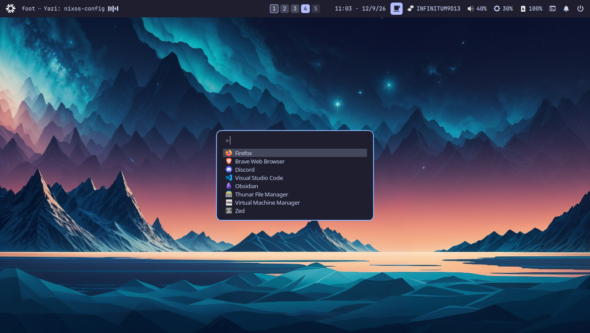

# NixOS Configuration

Personal NixOS configuration built with **Nix Flakes** and **Home Manager**.

This setup is centered around a minimal Wayland desktop using **Hyprland**, **Quickshell**, **UWSM**, and a declarative NixOS/Home Manager configuration.

> This repository is primarily designed for my own hardware and workflow.
> Use it as a reference rather than as a drop-in configuration.

## Stack

- **NixOS**
- **Nix Flakes**
- **Home Manager**
- **Hyprland**
- **UWSM**
- **Quickshell**
- **greetd + tuigreet**
- **Stylix**
- **PipeWire**
- **GNOME Keyring**
- **hyprpolkitagent**
- **nvf / Neovim**
- **Docker**

## Preview



## Repository Structure

```text
nixos-config/
├── README.md
├── flake.nix
├── flake.lock
├── elitebook/
│   ├── configuration.nix
│   ├── hardware-configuration.nix
│   └── modules/
└── home/
    ├── home.nix
    └── modules/
        ├── hyprland/
        ├── quickshell/
        ├── nvf/
        └── ...
```

### `elitebook/`

System-level NixOS configuration for my laptop.

It contains configuration for things such as:

- boot and hardware
- networking
- Docker
- virtualization
- greetd / tuigreet
- Polkit
- system services
- Stylix
- desktop integration

### `home/`

Home Manager configuration for my user environment.

It contains configuration for things such as:

- Hyprland
- Quickshell
- terminal and shell tools
- Neovim / nvf
- SSH
- development tools
- desktop applications
- user services

## Quickshell

The desktop shell is built with **Quickshell** instead of a traditional Waybar setup.

The configuration lives under:

```text
home/modules/quickshell/
```

It provides components such as:

```text
Quickshell
├── top bar
├── workspaces
├── active window
├── media indicator
├── audio controls
├── brightness controls
├── system tray
├── notifications
└── desktop menus
```


## Notes

This repository evolves together with my personal NixOS setup.

Some configuration is intentionally specific to my hardware, username, filesystem layout, and workflow.


